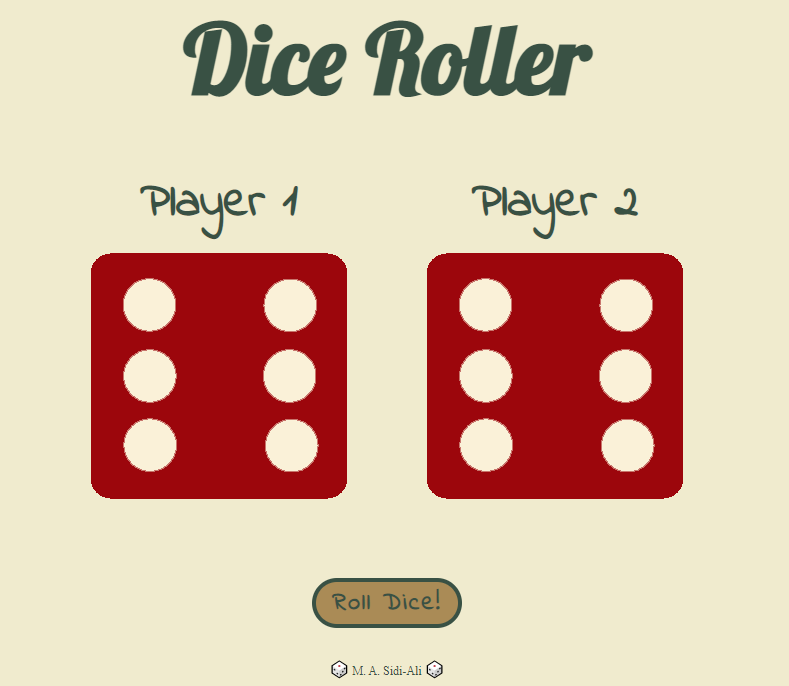

# Dice roller game.

## Table of contents

- [Overview](#overview)
  - [The project](#the-dice-roller)
  - [Screenshot](#screenshot)
  - [Links](#links)
- [My process](#my-process)
  - [Built with](#built-with)
  - [What I learned](#what-i-learned)
  - [Continued development](#continued-development)
  - [Useful resources](#useful-resources)
- [Author](#author)

## Overview

### The Dice Roller
- This website is made up of a fully responsive page with headings, dice for two players, and a roll dice button.
- When the button is clicked, the dice are thrown randomly.
- The h1 and h3 announce a winner depending on which player has a higher value.

### Screenshot

Below is a screenshot of my dice roller Website.

### Link

- Live Site URL: [Live Site](https://sidi-ali.github.io/dice-roller/)

## My process

I used a mobile-first workflow to complete this project.

### Built with

- HTML5
- CSS
- flexbox
- JavaScript
- DOM

### What I learned

Using the Document Object Model (DOM)  to Select and manipulate elements.

### Continued development

I am going to continue learning advanced JavaScript and DOM for manipulation.

### Useful resources

- [JavaScript onclick event](https://www.w3schools.com/jsref/event_onclick.asp)

## Author

- linkedin - [M. A. Sidi-Ali](https://www.linkedin.com/in/muhammad-adamu-sidi-ali-907a486b/)
